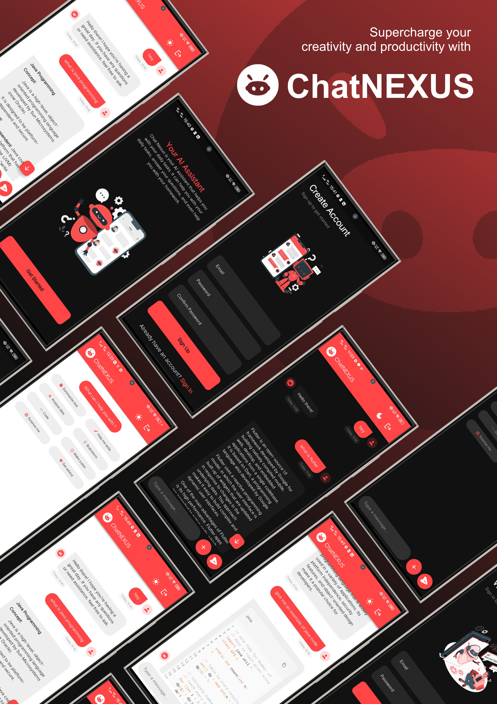

# ChatNexus 🤖

<div align="center">
  


Supercharge your creativity and productivity with ChatNexus - Your AI-powered chat companion! 🚀

</div>

## 📱 Overview

ChatNexus is a modern Flutter application that provides an intuitive interface for AI-powered conversations. Built with Flutter and powered by Google's Generative AI, it offers a seamless chat experience with both light and dark theme support.

## ✨ Features

- 🎨 Beautiful and responsive UI design
- 🌓 Dark/Light theme support
- 🔒 User authentication with Supabase
- 💬 Real-time chat with AI
- 🎵 Text-to-Speech capability
- 📱 Native splash screen
- 🔄 State management with Riverpod

## 🛠️ Tech Stack

- Flutter ^3.5.3
- flutter_riverpod for state management
- google_generative_ai for AI capabilities
- supabase_flutter for backend services
- flutter_markdown for text formatting
- flutter_native_splash for splash screen

## 🚀 Getting Started

### Prerequisites

- Flutter SDK ^3.5.3
- Dart SDK ^3.5.3
- Docker Desktop (optional)

### Installation

1. Clone the repository
```bash
git clone https://github.com/yourusername/chat-nexus.git
```

2. Install dependencies
```bash
flutter pub get
```

3. Create a `.env` file in the root directory with your API keys:
```env
SUPABASE_URL=your_supabase_url
SUPABASE_ANON_KEY=your_supabase_key
GEMINI_API_KEY=your_gemini_api_key
```

4. Run the app
```bash
flutter run
```

## 🤝 Contributing

Contributions are welcome! Feel free to submit a Pull Request.

## 📄 License

This project is licensed under the MIT License - see the [LICENSE](LICENSE) file for details.

## 🙏 Acknowledgments

- Flutter Team for the amazing framework
- Google for Gemini AI
- Supabase for backend services
